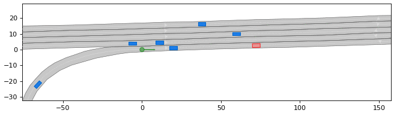

# TUM common road motion planning

Nice framework to start with.
It seems that all the tools you need are already there: vehicle models, optimisation, algorithms (Dijsktra, A-start,...).
The idea is to create a MPC-based motion planning writing my own collision methods (probably using cgal as well) and search algorithms.

